# TN — notes that feel like a Telegram chat

[](https://ko-fi.com/k_k)

TN is a conversation with yourself: topic chats instead of folders, messages instead of files. Ideas, to-do lists, photos, voice notes — sorted by topic, with reminders and `#tags`. Notes are stored locally; optional network features such as RSS, backups and update checks are used only when enabled. [Support the project — ko-fi.com/k_k](https://ko-fi.com/k_k)

> Screenshots below are in English (the interface language is switchable in Settings). The beta kanban board is intentionally not pictured — it is still under testing.

## Chats

Everything starts with the chat list. A fresh install greets you with an empty screen and a hint — tap the big button or the ✎ button at the bottom right.

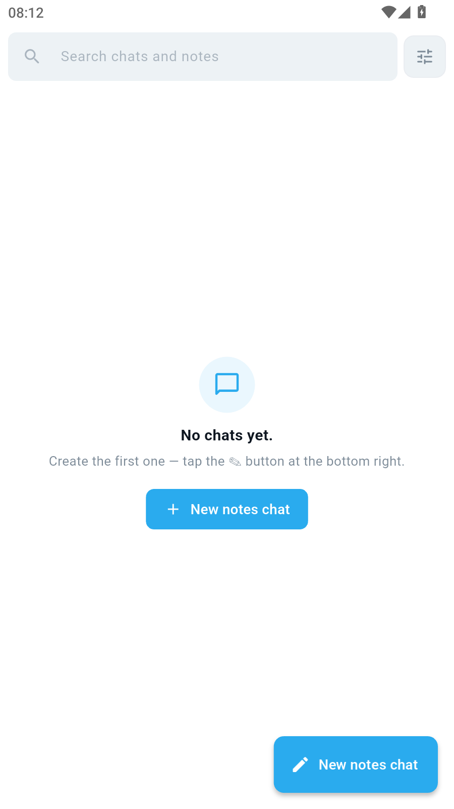

A lived-in list looks like a messenger: avatar with icon, name, last message and time. On top — search plus filters: All, Tasks, Notes, Tags, Upcoming.

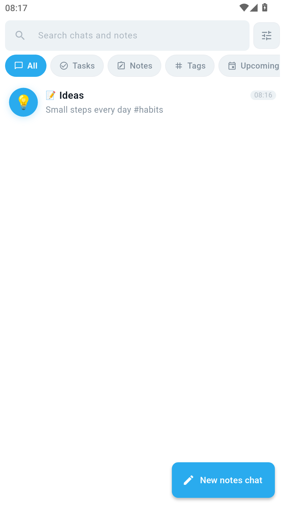

### New chat

Creating a chat picks its name, type, icon and color. Types:

- **Notes** — plain notes: text, photos, voice, files;
- **Tasks** — tasks with checkboxes, deadlines and repeats;
- **RSS channel** — read-only feed, new posts arrive as messages;
- **Kanban** — board with columns (in beta for now, see below).

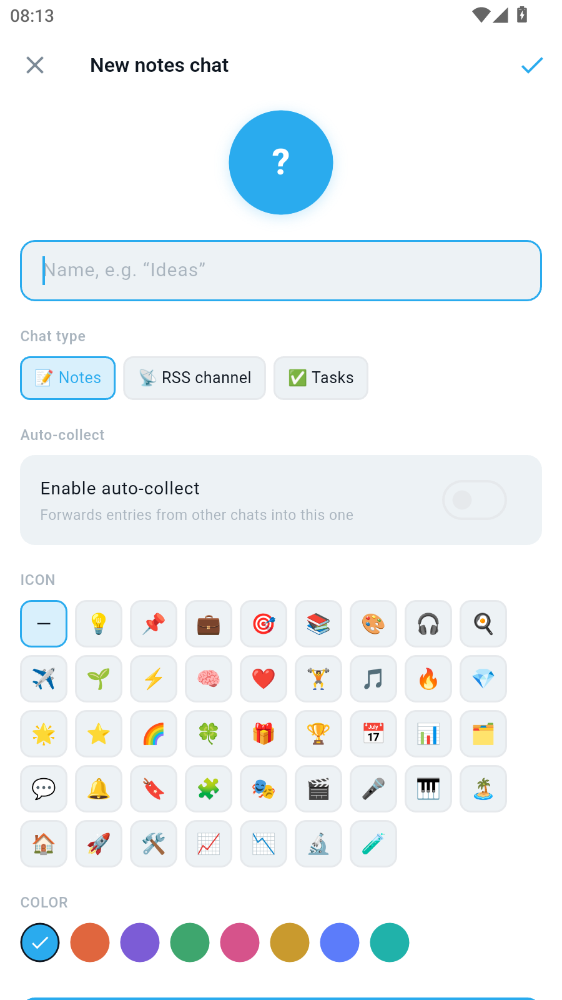

## Notes

A notes chat is a plain conversation with yourself. Hashtags in the text are highlighted and collected into pills under the message; search and the tags screen run on them.

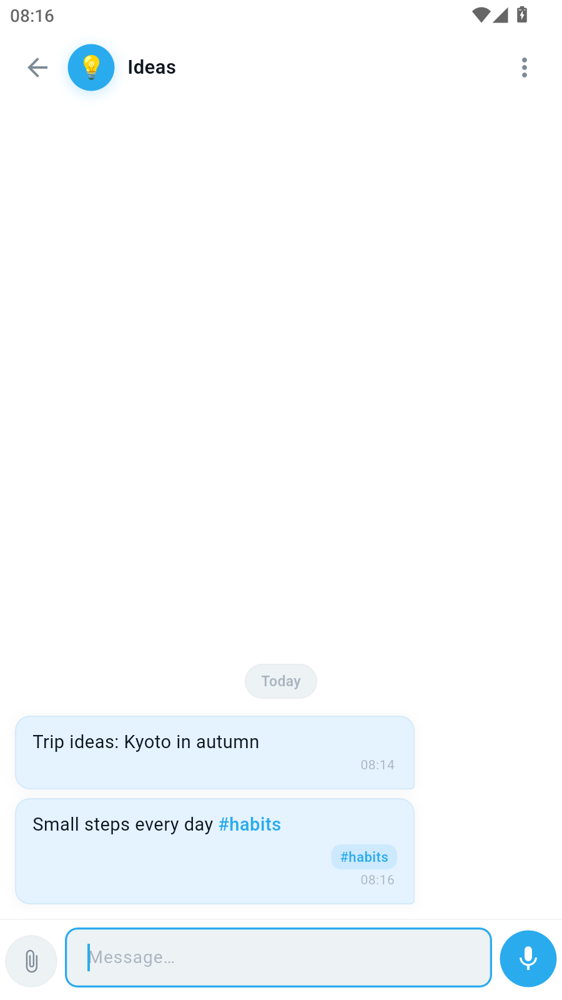

A long press on a message enables selection mode: tick several entries at once.

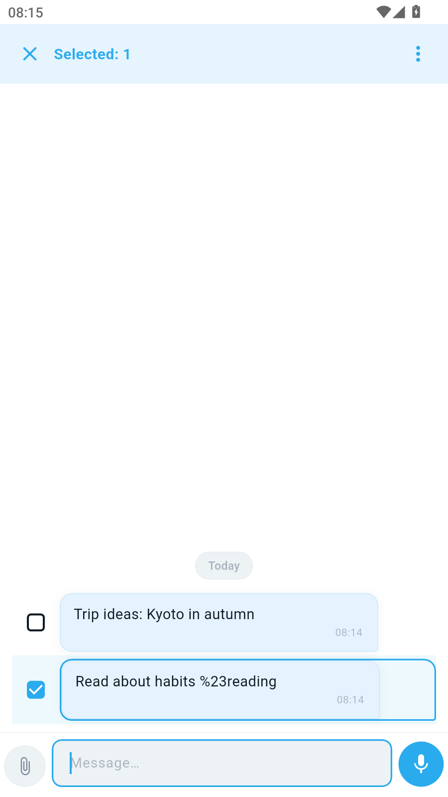

The ⋮ menu offers: edit, pin, copy, forward, share to an external app, delete.

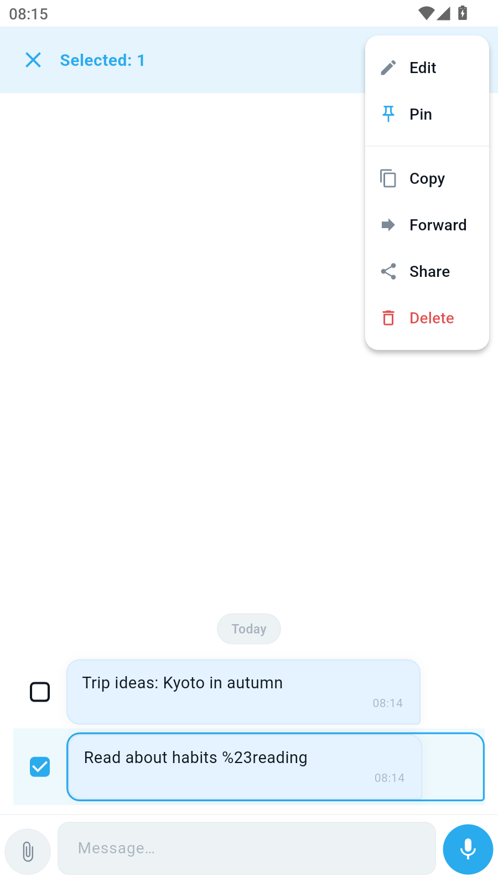

Deleted entries can always be brought back: instead of a confirmation dialog, a “Deleted · Undo” pill with a ~5-second countdown ring appears at the bottom.

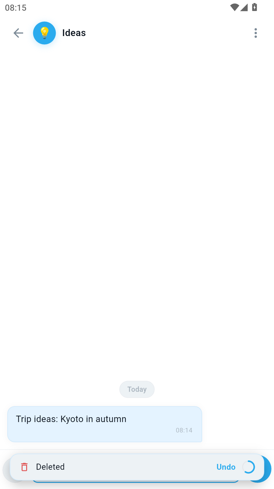

## Tasks and reminders

In a tasks chat the send button opens the **“Date, time & repeat”** sheet: date, time (07:00–21:00 presets), repeat (once / every day / weekdays / pick days / monthly) and priority (Normal / Important / Urgent).

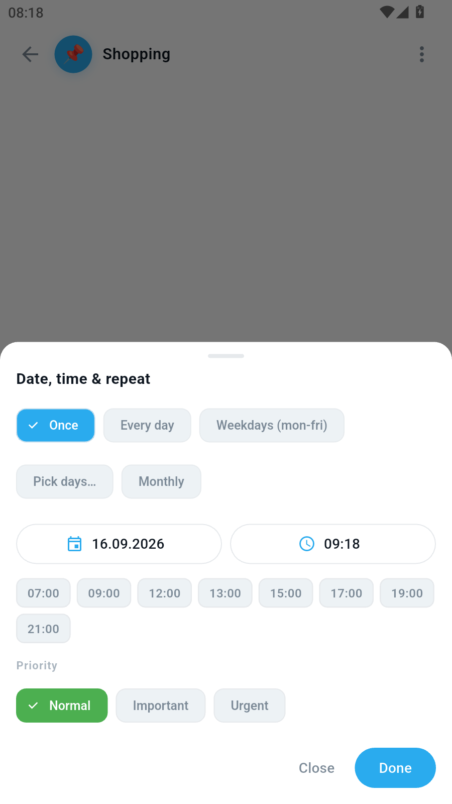

A finished task lives in the chat as a card with a checkbox and a due pill. Overdue items are highlighted.

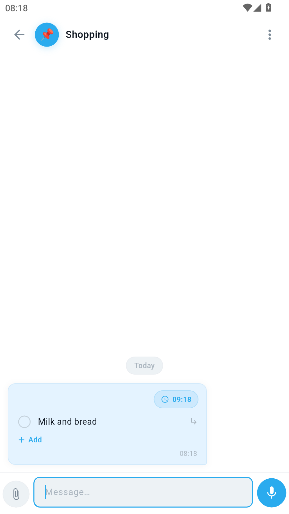

Reminders arrive as notifications with **Postpone** (+24 hours) and **Done** (close the task right from the shade) buttons. Done tasks never ring: checking one cancels its alarm automatically.

Long-pressing send opens the list editor: several items and sub-items at once, with the due date set via the clock icon in the same sheet.

## Search and tags

Search looks across all chats and entries (text, tags, checklist items). Tapping a result opens the chat scrolled exactly to the found message, highlighted.

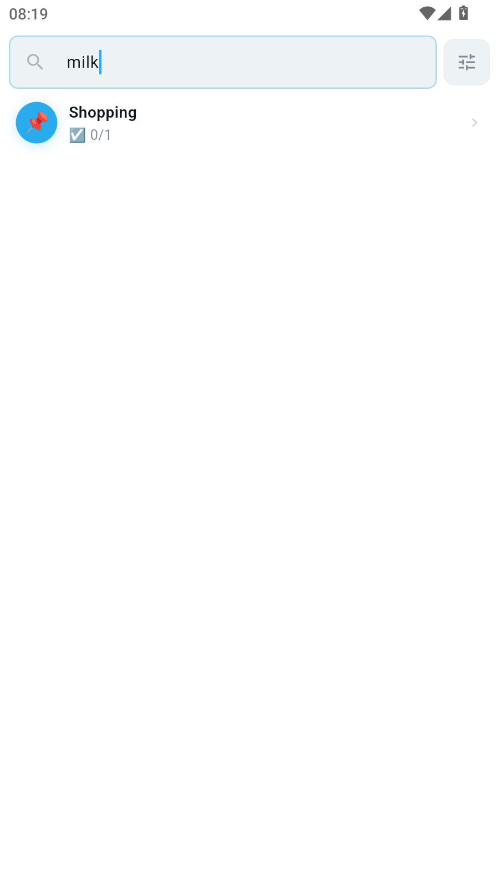

## Kanban board (beta)

A new chat type for running work in columns. Three by default — Idea / In progress / Done; custom columns are managed via ⋮ → Columns (or by long-pressing a tab): rename, add, delete. Deleting a column moves its cards into the first remaining one.

- Tabs with counters above the messages switch columns;
- swiping a card right pushes it to the next column (the last one is a stop);
- tapping the column badge on a card or “…” moves it to any column, including backwards;
- tap send = a quick text card in the current column, long-press send = a checklist card with a date;
- moving a todo card into the last column checks every item (alarms stop); moving it back out unchecks them; Undo restores the exact checkmarks;
- kanban tasks show up in the agenda and on the widget; forwarding into kanban lands the card in the first column.

## Widgets

Two widgets can be placed on the home screen:

- **Tasks** — undone todos from all chats (“Today” / “Upcoming” modes, priority-first with overdue items highlighted). Checkboxes tick right on the widget and sync with the app; tapping the text opens the chat at that message;
- **Kanban** — undone todos from kanban chats, grouped by column. Same behaviour: tick on the widget, tap to jump to the card.

Background transparency and font size are shared settings inside the app (Settings → Widget settings).

## Quick actions from the icon

Long-pressing the TN launcher icon shows two shortcuts with distinct icons:

- ➕ **Quick note** — jump straight into writing a new entry;
- ☑️ **Open agenda** — the upcoming-tasks screen.

## Folders, agenda, archive

- **Folders** — custom chat sets with names and colors (+ smart “Tasks”/“Notes” folders that collect chats by type automatically);
- **Agenda (Upcoming)** — every task with a deadline, grouped by day: overdue, today, tomorrow, later; filters All / Overdue / Today / Week / High;
- **Archive** — inactive chats leave the main screen;
- **Trash** — deleted chats wait out the retention period (configurable), one-tap restore.

## Settings

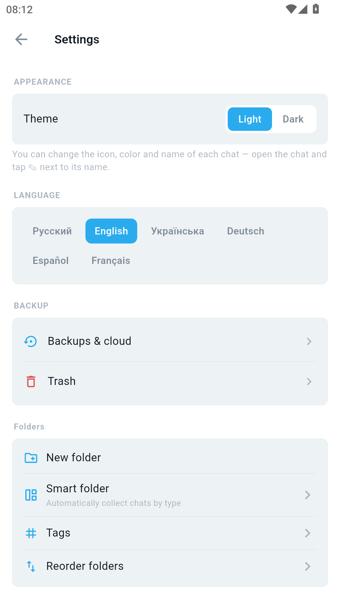 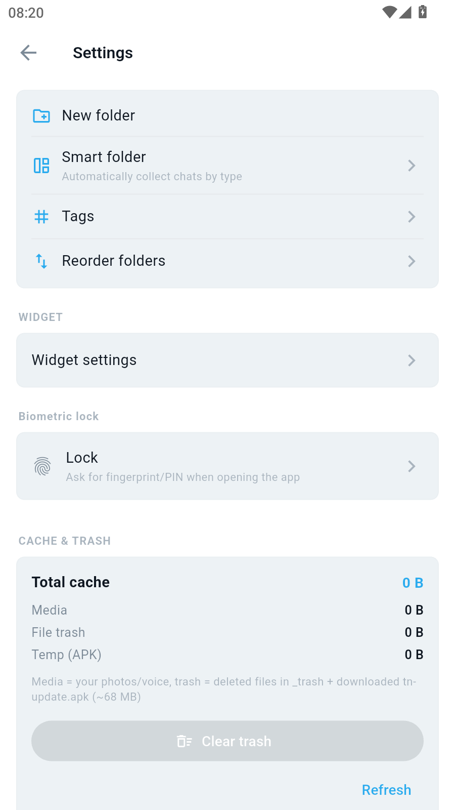

- theme (light/dark), 6 interface languages;
- backups & cloud, trash;
- folders, smart folders, tags, ordering;
- widget, app lock (biometrics / pattern / PIN, re-lock timeout);
- cache & trash with automatic cleanup on launch.

At the bottom — the About section: version, changelog, manual update check.

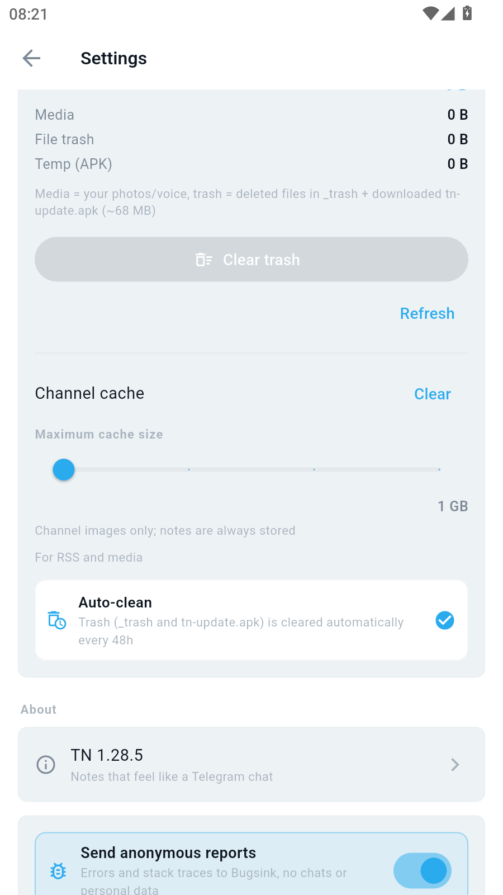 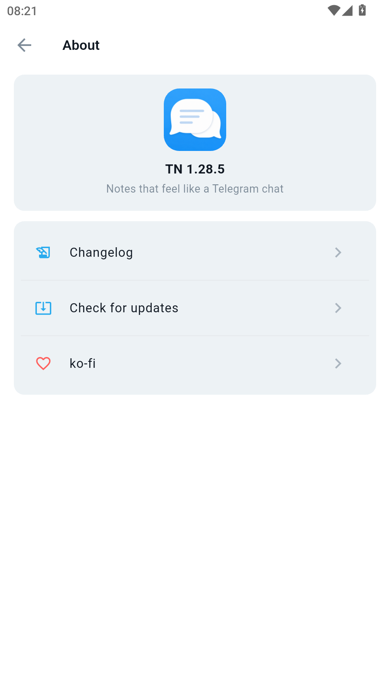

## Backups

One zip with the whole database, media and settings: locally into a folder of your choice (scheduled or manual), to Google Drive or Nextcloud. Backups are password-encrypted (AES-256-GCM) — they cannot be restored without it. Restoring takes a couple of taps, including from the welcome screen.

## For developers

```sh
flutter pub get
flutter run          # run
flutter test         # tests
flutter build apk --release   # APK: build/app/outputs/flutter-apk/app-release.apk
```

Beta builds ship via `vX.Y.Z-beta.N` tags through GitHub Actions (`.github/workflows/build.yml`): Android APKs (universal/arm64/x86_64) + Windows zip, the release is marked as prerelease. The English changelog in `CHANGELOG.md` feeds the in-app “What’s new” dialog and the release body.

## Support

TN is free and ad-free forever, developed on donations: **https://ko-fi.com/k_k** (also GitHub Sponsors).

## License

GPL-3.0 — see [LICENSE](LICENSE).
